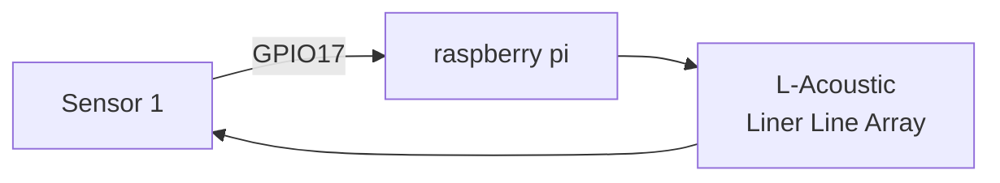
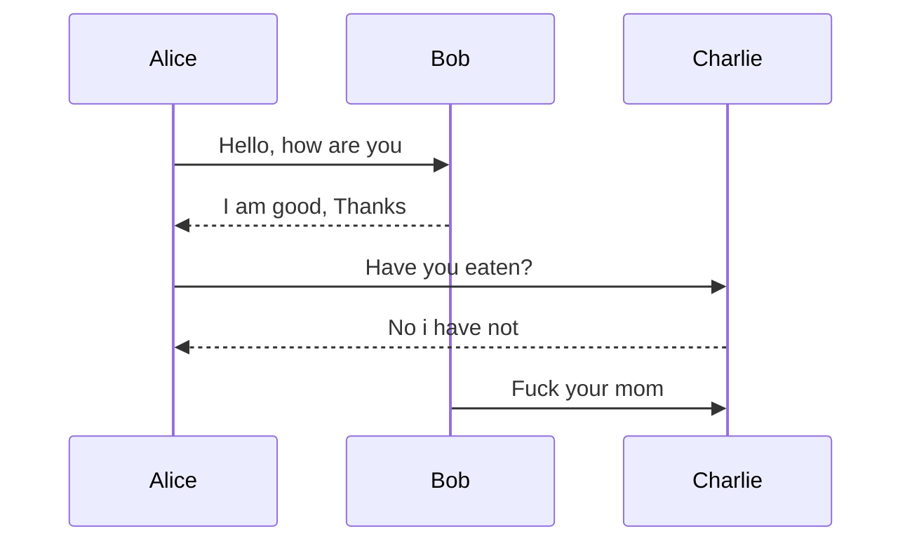

# Headers

This is for **heading 1**.


## Heading 2

This is for *heading 2*.


### Heading 3

This is for ***heading 3***

# List 

This is how you list items in markdown.
1. Member 1

   * Team leader

2. Member 2

    * Hardware

3. Member 3

    * Software

3. Member 4

    * Cheerleader

 # Inserting an Image
  To insert an image, you will need to drag + hold shift + drop


[Click here to GO TO CHAEWON](https://www.instagram.com/_chaechae_1/?hl=en)


[Click here to jump to test.md](/Test/Test.md)


# Code Block

To highlight or insert a particular section of code, You can do the following

1. In raspberry pi, if you want to update you will `sudo apt update`


```

from tkinter import *

main - Tk()

main.mainloop()

```

# Quotes

A famous quote by **Sir Isaac Newton**
>For every action, there will be a reaction.

# Tables

This is how you insert tables
```
|HeaderA|HeaderB|HeaderC|
|-------:|:-------|:-------:|
|Row 1|Data A|     Data B|
|Row 2 |             Data C| Data D

```


```

|------:| This is to justify Right

```

# Horizontal Line

This is how you insert a section line
```

---
```

# Flowchart




# Sequence Diagram


`->>` is  normal </br>
`-->>` is dotted